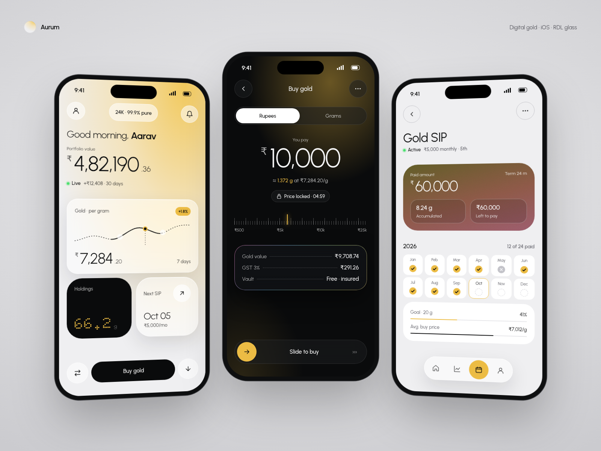
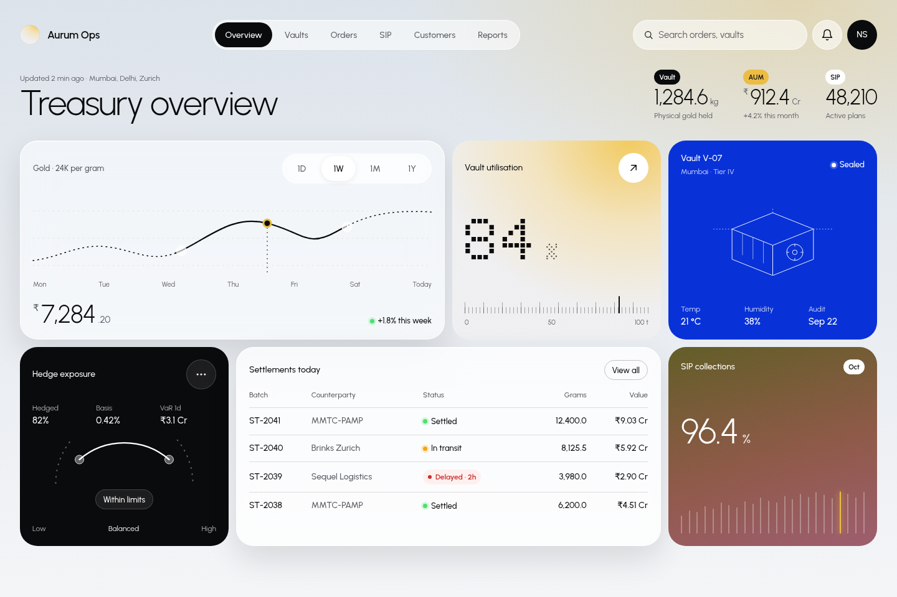
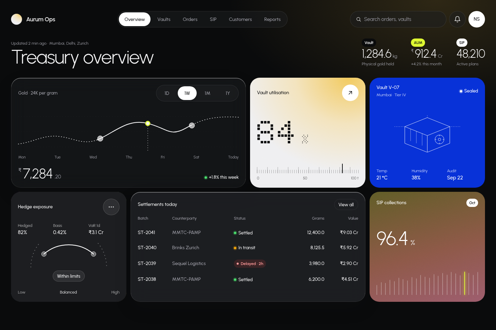
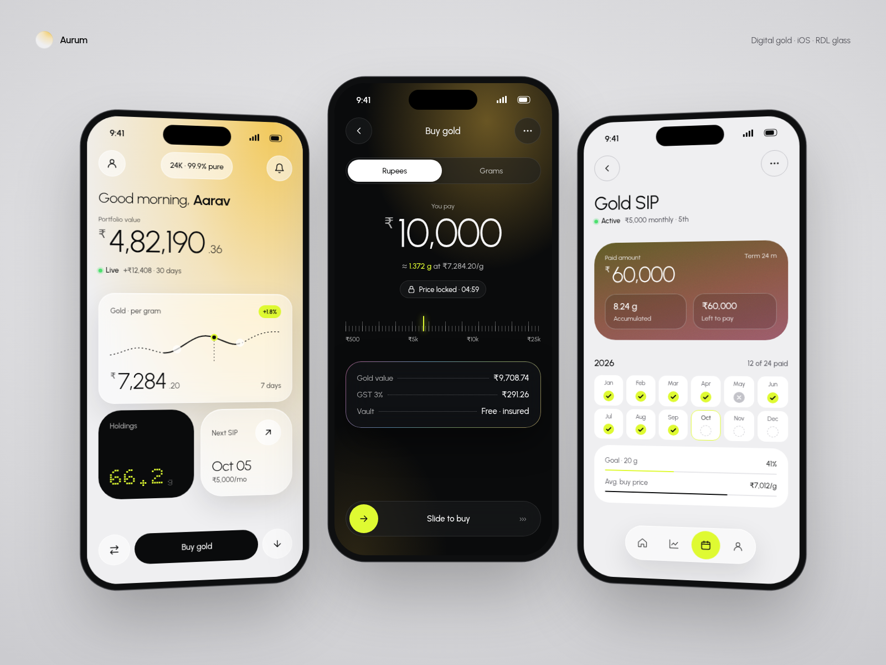
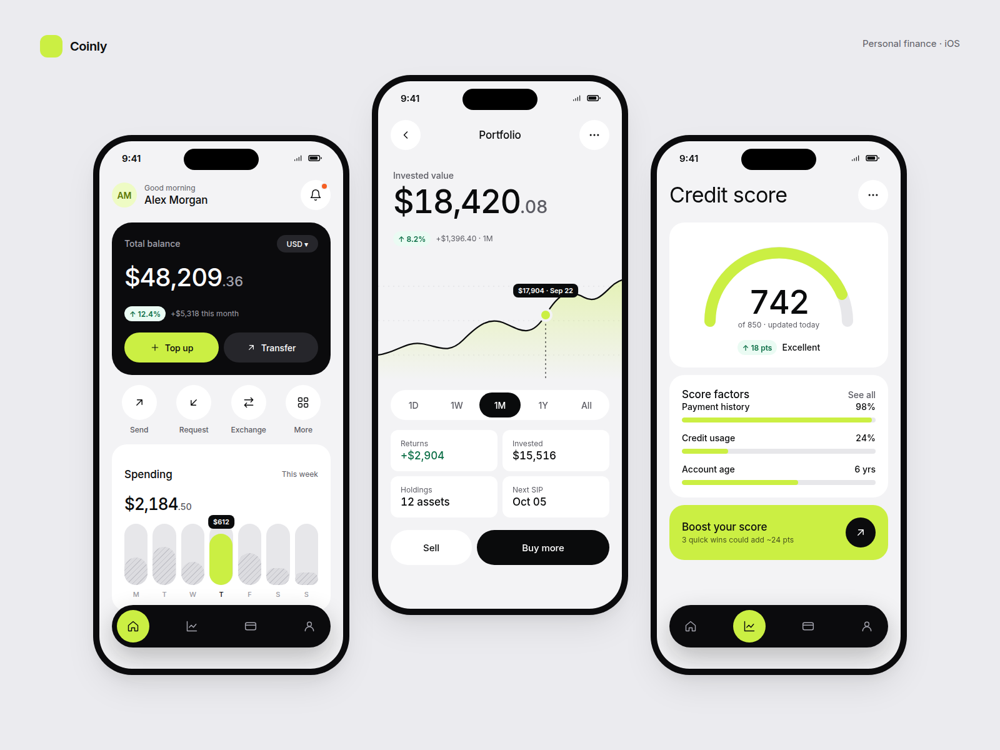

# RDL Theme · v3

A Claude Code skill and design system for building apps in the visual language of
[RonDesignLab](https://dribbble.com/RonDesignLab). It's based on **two passes over 220 RDL
shots**: one for style and one for structure (spacing, grids, anatomy), plus pixel calibration of
the colors. The style is:
- frosted glass over photos, 3D renders and soft gradient auras
- huge light-weight numerals with small muted units, plus dot-matrix figures
- orbs, pills and circle–pill–circle action rows
- tick rulers and hairline instruments
- status dots
- line-art and blueprint illustration

The original flat fintech look (v1) ships as an option.

**New in v3:** a measured layout system (spacing ladder, screen skeleton, 12-column bento,
control-height ladder, nested radius), exact component anatomy, a usage rulebook (hierarchy,
color budget, app-wide consistency) and **`audit_ui.mjs`**. The audit renders a page and fails
on off-scale type, off-ladder spacing, wrong radii, mixed control heights, crowded pinned zones
and text contrast measured on the real pixels. Both reference templates pass with 0 errors.

Ask Claude something like *"build the SIP screen of my gold app in RDL theme, SwiftUI, gold
accent"*. It follows the rules, tokens, components and QA checklist in this repo.



| Glass dashboard · light | Glass dashboard · dark |
|---|---|
|  |  |

| Glass · volt accent | Flat (v1) option |
|---|---|
|  |  |

## Install

**As a Claude Code plugin**
```
/plugin marketplace add nkchaudhary-1/RDL-Theme
/plugin install rdl-theme@rdl-theme
```

**As a standalone skill**
```bash
git clone https://github.com/nkchaudhary-1/RDL-Theme
cp -r RDL-Theme/skills/rdl-theme ~/.claude/skills/            # all projects
# or: cp -r RDL-Theme/skills/rdl-theme <project>/.claude/skills/  # one project
```

## Use it in code

**Web**
```html
<link href="https://fonts.googleapis.com/css2?family=Urbanist:wght@300;400;500;600;700&family=Doto:wght@700&display=swap" rel="stylesheet">
<link rel="stylesheet" href="tokens.css">
<link rel="stylesheet" href="rdl-components.css">
<html data-theme="light" data-style="glass" data-accent="gold">
```
**Tailwind:** import `tokens.css`, then `presets: [require('./tailwind.preset.js')]`.

**SwiftUI (iOS 17+):** add `RDLTokens.swift`, `RDLComponents.swift`,
`RDLGlassComponents.swift` and `RDLLayout.swift`, then at the root:
```swift
ContentView().rdlAccent(.gold).rdlSurfaceStyle(.glass)
```

| Switch | Values |
|---|---|
| Style | `glass` (default) · `flat` (v1) |
| Accent | `volt` (default) · `gold` · `signal` · `electric` · `ember` · `orchid` · `rose` · `lime` · `violet` · `orange` · `ocean` |
| Theme | `light` · `dark` · system |

## What's inside

```
skills/rdl-theme/
├── SKILL.md                     RDL DNA, workflow, quick reference, anti-patterns
├── references/
│   ├── layout.md                Spacing ladder, screen skeleton, grids, alignment, control heights, radius
│   ├── anatomy.md               Exact specs for every component and layout primitive
│   ├── guidelines.md            Rulebook: hierarchy, type, color budget, consistency, minimalism
│   ├── design-study.md          220-frame analysis: frequencies, 20 structural rules, v1→v3
│   ├── foundations.md           Modes, color, accents, auras, glass, type and numerals, radius, imagery, motion
│   ├── components.md            Glass + base components, SVG patterns, domain compositions
│   ├── screen-patterns.md       Glass G1–G8 / W5–W7, flat M1–M7 / W1–W4
│   ├── domain-playbooks.md      Wealth/gold/SIP/lease, banking, health, energy, logistics, industrial…
│   ├── presentation.md          Hands, depth-of-field close-ups, angled devices, three-phone perspective
│   └── qa-checklist.md
├── assets/
│   ├── tokens/                  tokens.json (source) → tokens.css, tailwind.preset.js
│   ├── ios/                     RDLTokens.swift (generated), RDLComponents.swift, RDLGlassComponents.swift, RDLLayout.swift
│   └── templates/               rdl-components.css, glass + flat mobile and dashboard references
└── scripts/
    ├── build_tokens.mjs         tokens.json → CSS / Tailwind / Swift
    ├── audit_ui.mjs             Layout, consistency and contrast audit for any HTML build
    └── extract_palette.py       Pixel-calibrate tokens against exported shots
research/
├── moodboard-notes.md           Pass 1: per-frame style notes (220 frames)
├── deep-scan.md                 Pass 2: per-frame structure, radius, type and composition notes
├── calibration.md               Pixel-sampled colors and measured layout values
└── frames.tsv                   Frame index used for calibration
```

Single-file style guide: [`DESIGN-STYLE.md`](DESIGN-STYLE.md).

Changing tokens:
```bash
node skills/rdl-theme/scripts/build_tokens.mjs
node scripts/render-previews.mjs     # refresh docs/ screenshots (needs Playwright)
```

Auditing a page (0 errors before shipping):
```bash
node skills/rdl-theme/scripts/audit_ui.mjs my-screen.html                 # phone shot, 44pt targets
node skills/rdl-theme/scripts/audit_ui.mjs dashboard.html --w 1440 --h 960 # desktop, pointer targets
```
Put `data-audit-scope` on the product UI root and `data-audit-ignore` on presentation chrome.

## Status

- **Evidence:** every frame on the board was viewed twice (style, then structure) and annotated.
  Colors are pixel-sampled from the board renders (`research/calibration.md`). Layout values are
  measured from mostly angled or depth-of-field shots, so treat them as ±2pt, snapped to the 4pt
  grid. To re-run calibration on your own exports, put them in `research/shots/` (git-ignored)
  and run `python3 skills/rdl-theme/scripts/extract_palette.py research/shots`.
- **SwiftUI** was written without a compiler in the build environment. Build it once in Xcode
  and report any fixes. The audit covers HTML builds; apply the QA checklist by hand for SwiftUI.
- **Flat (v1) templates** keep their original inline values and aren't audit-clean; the glass
  templates are the v3 reference.

## Note

Independent style study, not affiliated with or endorsed by RonDesignLab. The repo contains no
RDL artwork; the reference screens are original compositions with fictional data.
