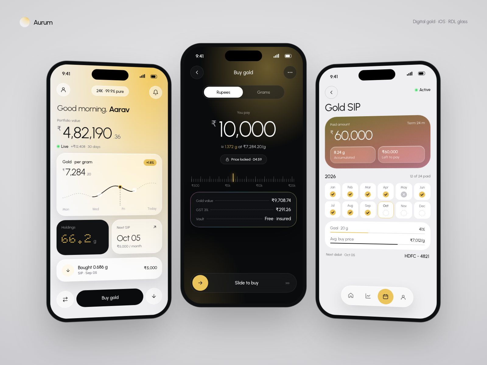
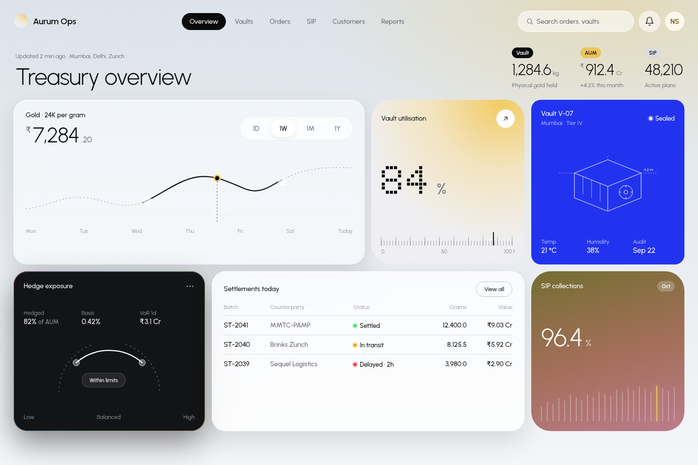
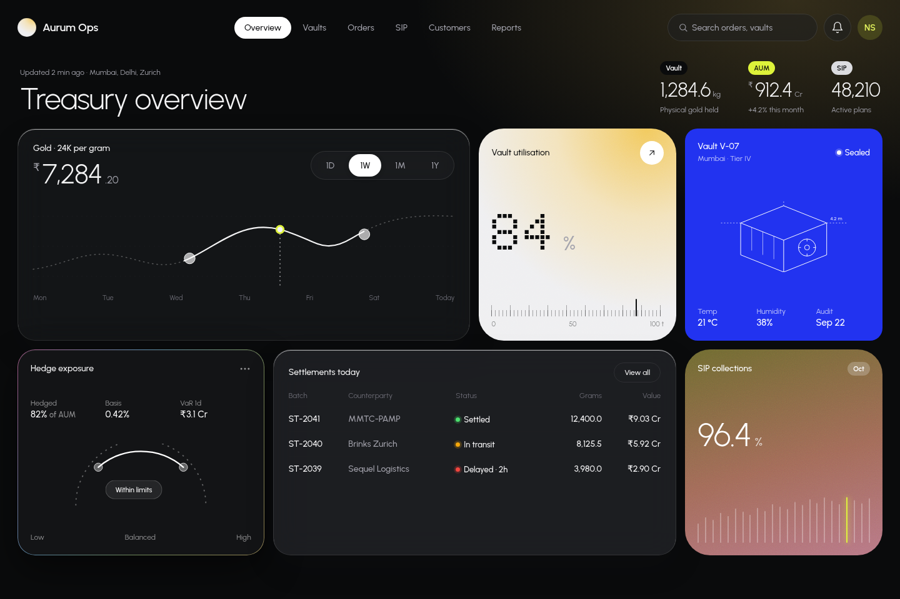

# RDL Theme · v2

A Claude Code skill and design system for building apps in the visual language of
[RonDesignLab](https://dribbble.com/RonDesignLab). v2 is based on a frame-by-frame study of
**220 RDL shots**:
- frosted glass over photos, 3D renders and soft gradient auras
- huge light-weight numerals with small muted units, plus dot-matrix figures
- orbs, pills and circle–pill–circle action rows
- tick rulers and hairline instruments
- status dots
- line-art and blueprint illustration

The original flat fintech look (v1) ships as an option.

Ask Claude something like *"build the SIP screen of my gold app in RDL theme, SwiftUI, gold
accent"*. It follows the rules, tokens, components and QA checklist in this repo.



| Glass dashboard · light | Glass dashboard · dark |
|---|---|
|  |  |

| Glass · volt accent | Flat (v1) option |
|---|---|
|  |  |

## Install

**As a Claude Code plugin**
```
/plugin marketplace add nkchaudhary-1/RDL-Theme
/plugin install rdl-theme@rdl-theme
```

**As a standalone skill**
```bash
git clone https://github.com/nkchaudhary-1/RDL-Theme
cp -r RDL-Theme/skills/rdl-theme ~/.claude/skills/            # all projects
# or: cp -r RDL-Theme/skills/rdl-theme <project>/.claude/skills/  # one project
```

## Use it in code

**Web**
```html
<link href="https://fonts.googleapis.com/css2?family=Urbanist:wght@300;400;500;600;700&family=Doto:wght@700&display=swap" rel="stylesheet">
<link rel="stylesheet" href="tokens.css">
<link rel="stylesheet" href="rdl-components.css">
<html data-theme="light" data-style="glass" data-accent="gold">
```
**Tailwind:** import `tokens.css`, then `presets: [require('./tailwind.preset.js')]`.

**SwiftUI (iOS 17+):** add `RDLTokens.swift`, `RDLComponents.swift` and
`RDLGlassComponents.swift`, then at the root:
```swift
ContentView().rdlAccent(.gold).rdlSurfaceStyle(.glass)
```

| Switch | Values |
|---|---|
| Style | `glass` (default) · `flat` (v1) |
| Accent | `volt` (default) · `gold` · `signal` · `electric` · `ember` · `orchid` · `lime` · `violet` · `orange` · `ocean` |
| Theme | `light` · `dark` · system |

## What's inside

```
skills/rdl-theme/
├── SKILL.md                     RDL DNA, workflow, quick reference, anti-patterns
├── references/
│   ├── design-study.md          220-frame analysis: pattern frequencies, variants, finance frames, v1→v2
│   ├── foundations.md           Modes, color, accents, auras, glass, type and numerals, radius, imagery, motion
│   ├── components.md            Glass + base components, SVG patterns, domain compositions
│   ├── screen-patterns.md       Glass G1–G8 / W5–W7, flat M1–M7 / W1–W4
│   ├── domain-playbooks.md      Wealth/gold/SIP/lease, banking, health, energy, logistics, industrial…
│   ├── presentation.md          Hands, depth-of-field close-ups, angled devices, three-phone perspective
│   └── qa-checklist.md
├── assets/
│   ├── tokens/                  tokens.json (source) → tokens.css, tailwind.preset.js
│   ├── ios/                     RDLTokens.swift (generated), RDLComponents.swift, RDLGlassComponents.swift
│   └── templates/               rdl-components.css, glass + flat mobile and dashboard references
└── scripts/
    ├── build_tokens.mjs         tokens.json → CSS / Tailwind / Swift
    └── extract_palette.py       Pixel-calibrate tokens against exported shots
research/moodboard-notes.md      Per-frame notes from the 220-shot scan
```

Changing tokens:
```bash
node skills/rdl-theme/scripts/build_tokens.mjs
node scripts/render-previews.mjs     # refresh docs/ screenshots (needs Playwright)
```

## Status

- **Evidence:** every frame on the board was viewed and annotated. Colors are judged by eye from
  the rendered screenshots, because the image host was blocked in the build environment. For
  pixel-exact values, export shots to `research/shots/` (git-ignored) and run
  `python3 skills/rdl-theme/scripts/extract_palette.py research/shots`.
- **SwiftUI** was written without a compiler in the build environment. Build it once in Xcode
  and report any fixes.

## Note

Independent style study, not affiliated with or endorsed by RonDesignLab. The repo contains no
RDL artwork; the reference screens are original compositions with fictional data.
