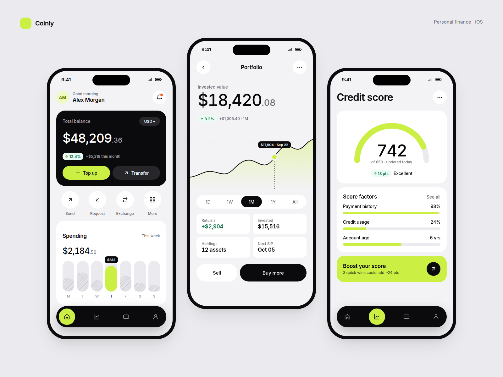
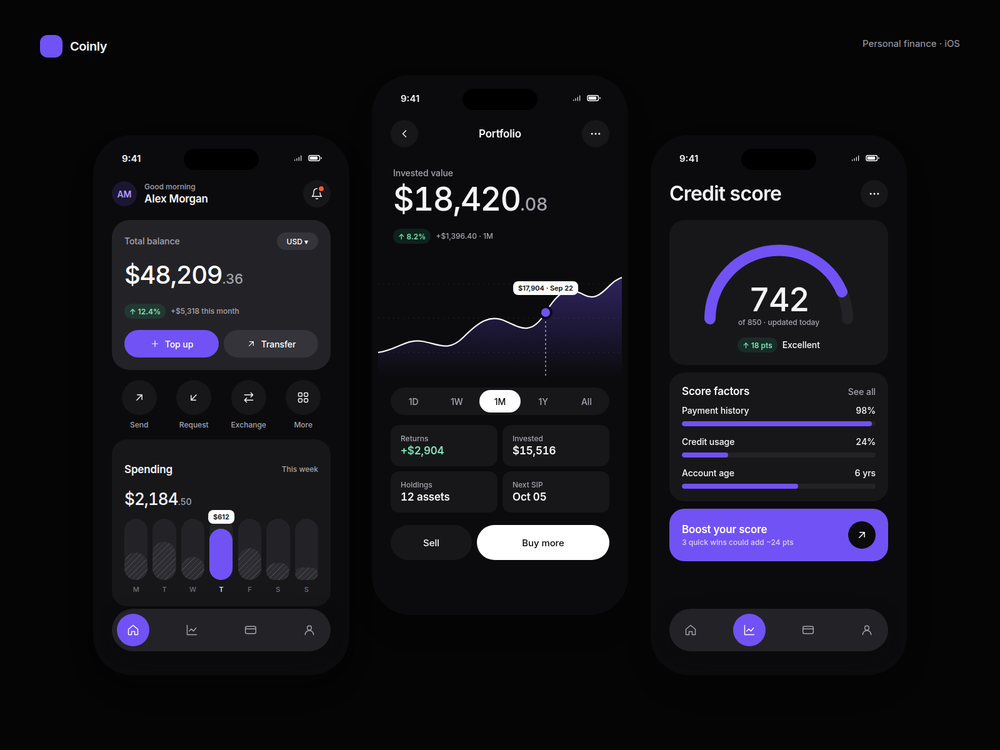
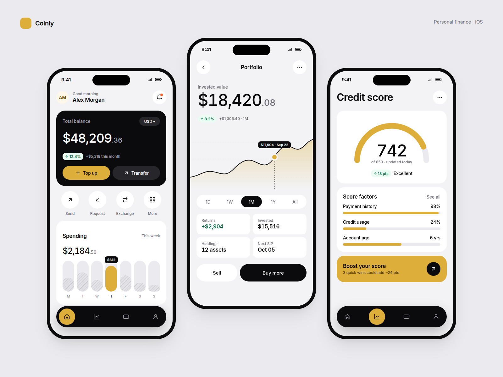
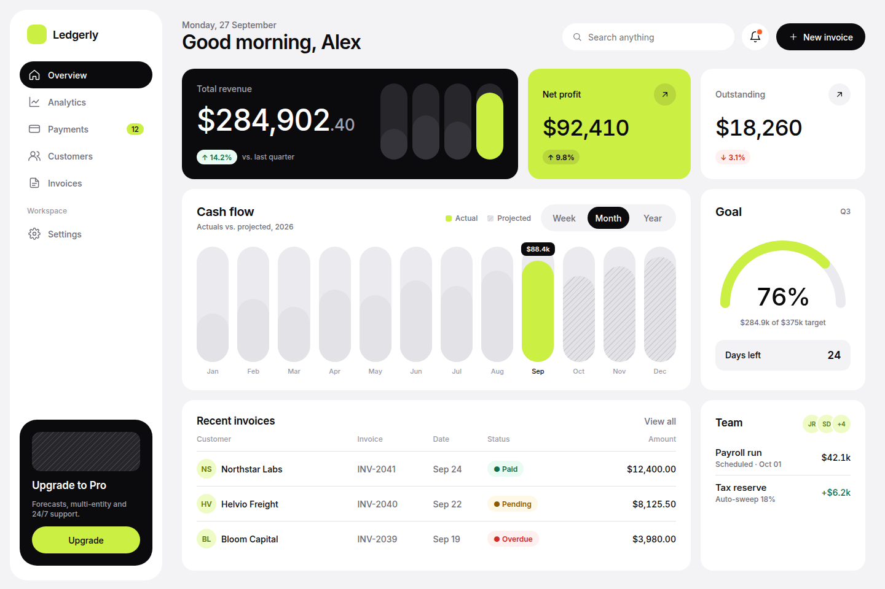
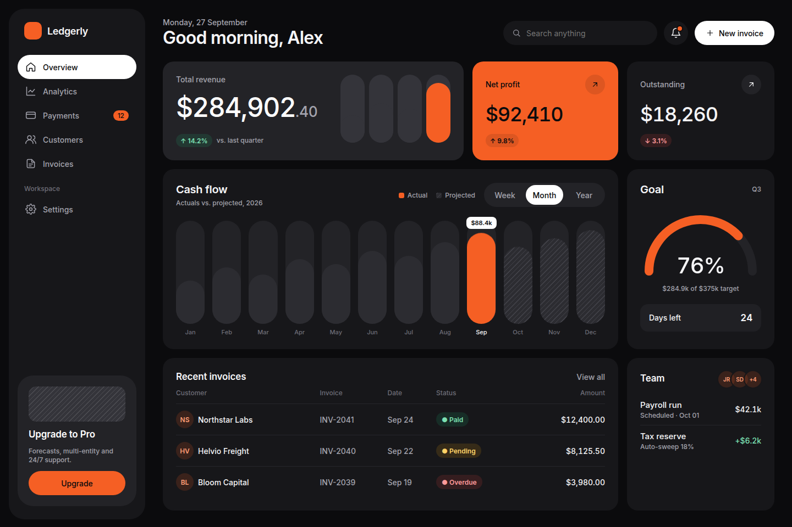

# RDL Theme

A Claude Code skill and design system for building apps in the visual language of
[RonDesignLab on Dribbble](https://dribbble.com/RonDesignLab): gray canvas, white rounded
cards, one ink hero card, a single loud accent, big medium-weight numbers, pill controls,
hatched bar charts and a floating dark tab bar.

Tell Claude *"build the portfolio screen in RDL theme"* and it follows the rules, tokens,
components and QA checklist in this repo.



| Dark · violet | Light · gold |
|---|---|
|  |  |

| Dashboard · light | Dashboard · dark orange |
|---|---|
|  |  |

## Install

**As a Claude Code plugin**
```
/plugin marketplace add nkchaudhary-1/RDL-Theme
/plugin install rdl-theme@rdl-theme
```

**As a standalone skill**
```bash
git clone https://github.com/nkchaudhary-1/RDL-Theme
cp -r RDL-Theme/skills/rdl-theme ~/.claude/skills/            # all projects
# or: cp -r RDL-Theme/skills/rdl-theme <project>/.claude/skills/  # one project
```

Then ask for things like:
- "Build the Home screen of my gold investment app in RDL theme, SwiftUI, gold accent."
- "RDL-style SaaS dashboard for invoicing in React + Tailwind."
- "Make a Dribbble shot of these three screens, RDL presentation."

## What's inside

```
skills/rdl-theme/
├── SKILL.md                    The rules (RDL DNA), workflow and quick reference
├── references/
│   ├── design-study.md         Portfolio analysis, shot inventory, patterns, evidence level
│   ├── foundations.md          Color, type, spacing, radius, elevation, icons, motion
│   ├── components.md           Component specs + how domain components compose
│   ├── screen-patterns.md      Mobile (M1–M7) and web (W1–W4) archetypes with wireframes
│   ├── domain-playbooks.md     Fintech, wealth/gold/SIP, credit, health, logistics, SaaS, crypto…
│   ├── presentation.md         Dribbble-shot composition
│   └── qa-checklist.md         Pre-delivery review
├── assets/
│   ├── tokens/tokens.json      Source of truth
│   ├── tokens/tokens.css       Generated CSS variables (light/dark × 5 accent packs)
│   ├── tokens/tailwind.preset.js
│   ├── ios/RDLTokens.swift     Generated SwiftUI tokens
│   ├── ios/RDLComponents.swift Card, buttons, amount, delta, segmented, bar chart, gauge, tab bar…
│   └── templates/              rdl-components.css, mobile-app.html, web-dashboard.html
└── scripts/
    ├── build_tokens.mjs        tokens.json → CSS / Tailwind / Swift
    └── extract_palette.py      Calibrate tokens against real shots (ΔE drift report)
```

### Accent packs
`lime` (default, the RDL signature) · `violet` · `orange` · `ocean` · `gold`.
Web: `<html data-theme="light|dark" data-accent="gold">`. SwiftUI: `.rdlAccent(.gold)`.

### Changing tokens
Edit `skills/rdl-theme/assets/tokens/tokens.json`, then:
```bash
node skills/rdl-theme/scripts/build_tokens.mjs
node scripts/render-previews.mjs   # optional: refresh docs/ screenshots (needs Playwright)
```

## Status and calibration

v1 was built from the portfolio's shot inventory and RDL's recurring visual language; the
Dribbble site itself was not reachable from the build environment, so **colors and sizes are
set by eye, not pixel-sampled**. To calibrate:

1. Save 20–40 recent RDL shots into `research/shots/` (git-ignored — don't commit their work).
2. `pip install pillow && python3 skills/rdl-theme/scripts/extract_palette.py research/shots`
3. Update any token flagged `← drift` in `tokens.json`, rebuild, re-render.

## Note

Independent style study. Not affiliated with or endorsed by RonDesignLab. The repo contains no
RDL artwork; the reference screens are original compositions with fictional data.
